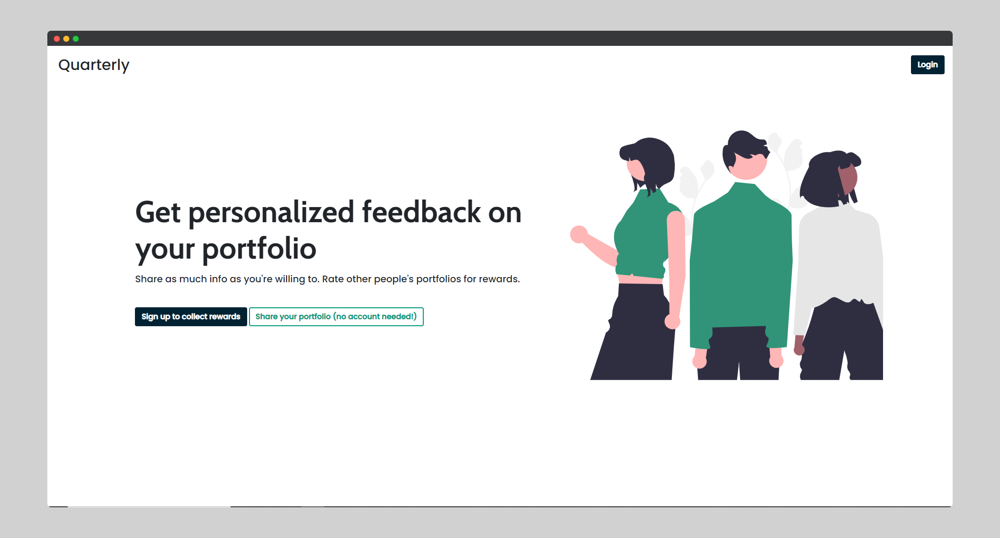
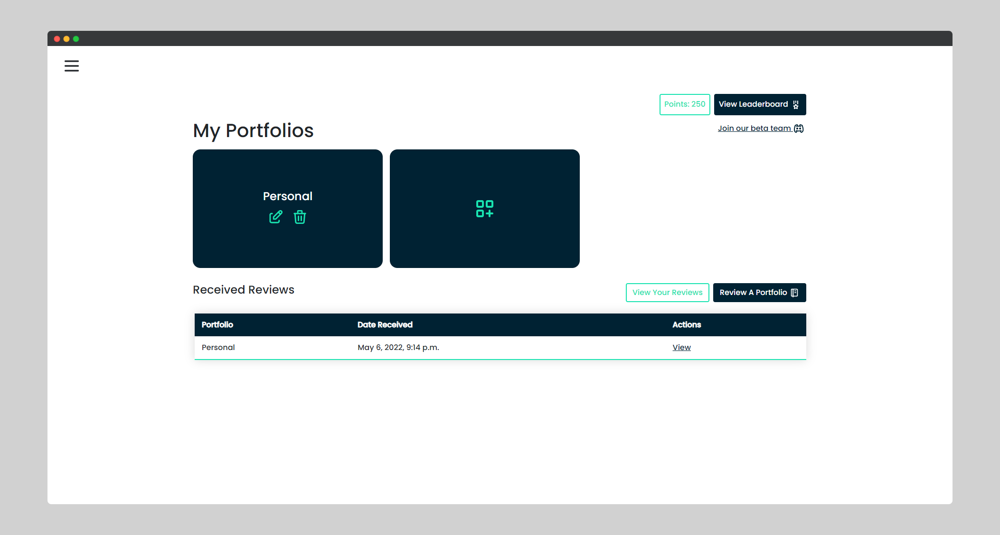
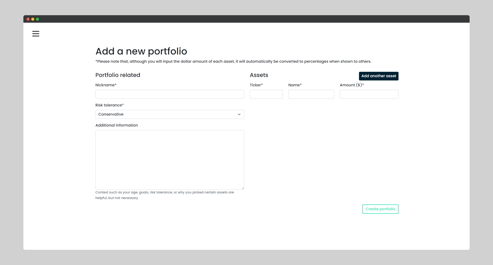

# [📔 Quarterly - get free feedback on your investment portfolio!](https://quarterlyportfolio.herokuapp.com/)

Sharing your portfolio on platforms such as Reddit can be tedious, and worst of all, you're probably won't get much feedback.

Quarterly was built to try and solve this. By offering an easy-to-use portfolio import process and making sure you include important information that reviewers need, you have a much higher chance of getting useful feedback.

## ⚡ Latest Production Build
You can find the latest production build at:
https://quarterlyportfolio.herokuapp.com/

## 📷 Screenshots

## ⭐ Features
Some features that Quarterly offers include:
- Add and store multiple portfolios
- Easily add multiple assets belonging to a respective portfolio
- Rewards system with leaderboard

## ⛏ Built With
Technologies used:
- Django
- Bootstrap 5
- Whitenoise

## Contact Or Support?
If you like Quarterly, please leave a star ⭐! Also don't hestiate if you have any questions or suggestions.
